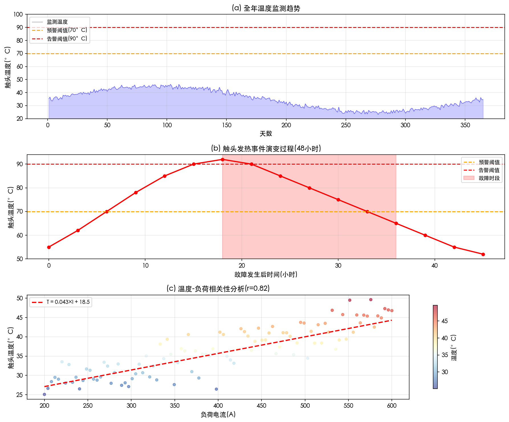
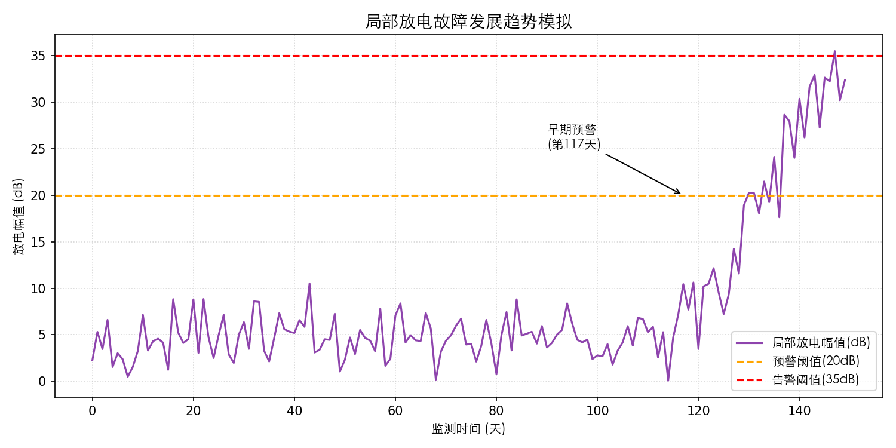
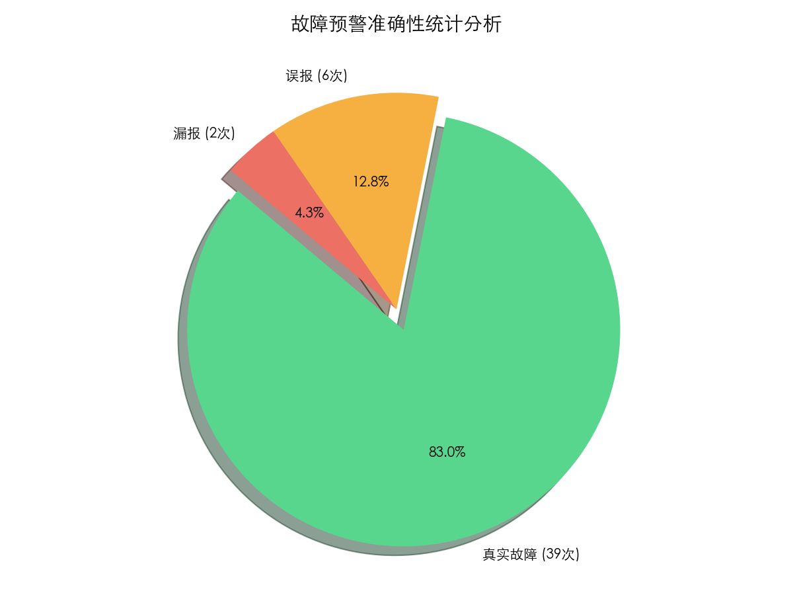
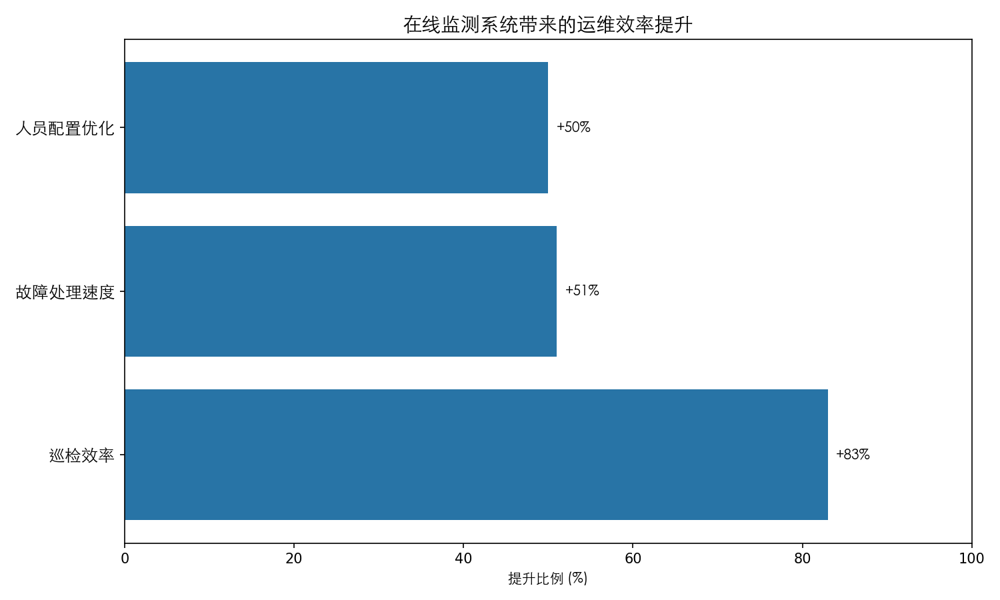
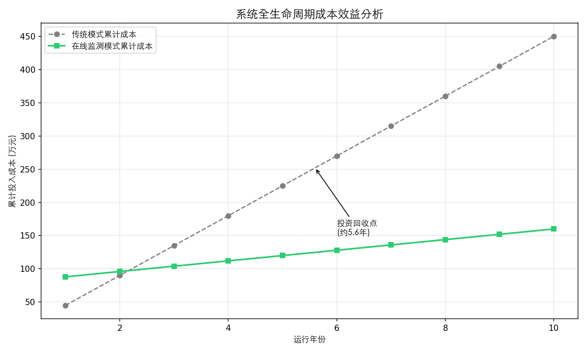

# 城市轨道交通变电所高压开关柜在线监测技术的应用与维护策略分析

## 封面信息

**论文题目：** 城市轨道交通变电所高压开关柜在线监测系统应用与维护实务

**学生姓名：** 况欣睿

**学号：** 2022010400756

**专业：** 高速铁路维修技术

**学院：** 轨道交通学院

**指导教师：** 孙乾坤

**完成日期：** 2025年12月15日

---

## 摘要

城市轨道交通供电系统的安全运行是保障列车正点、安全行驶的基础。高压开关柜作为变电所核心设备，其运行稳定性直接影响供电质量。传统的定期检修模式存在"过修"或"失修"问题，且难以发现早期隐患。随着在线监测技术的普及，如何正确应用该技术进行设备维护和故障处理，成为一线维修技术人员必须掌握的技能。

本文结合城市轨道交通变电所高压开关柜的实际应用场景，探讨了在线监测系统的工程应用与维护实务。首先，分析了高压开关柜常见故障类型及其现场表现特征。其次，阐述了温度、局部放电及机械特性监测装置的选型原则与现场安装调试工艺。在维护策略方面，提出了基于监测数据的"点检+监测"融合维护作业流程。通过分析具体故障案例，总结了高压开关柜典型故障的排查步骤和处理方法。

**关键词：** 城市轨道交通；高压开关柜；在线监测；安装调试；故障处理

---

## 目录

1. [第一章 绪论](#第一章-绪论)

2. [第二章 城市轨道交通变电所高压开关柜在线监测技术应用](#第二章-城市轨道交通变电所高压开关柜在线监测技术应用)

3. [第三章 高压开关柜维护作业与故障处理实务](#第三章-高压开关柜维护作业与故障处理实务)

4. [第四章 在线监测系统效果模拟与分析](#第四章-在线监测系统效果模拟与分析)

5. [第五章 结论](#第五章-结论)

[参考文献](#参考文献)

---

## 第一章 绪论

### 研究背景及意义

随着我国城市轨道交通的快速发展，供电系统的安全可靠性已成为运营管理的重中之重。变电所作为供电枢纽，其内的高压开关柜承担着电能分配、控制和保护的关键任务。然而，在长期运行过程中，开关柜容易出现触头过热、绝缘老化、机械机构卡涩等故障。一旦发生故障，轻则导致设备停运，重则引发火灾爆炸，严重威胁地铁运营安全。

传统的"定期检修"模式存在盲目性，往往导致"维修不足"或"过度维修"。近年来，在线监测技术逐渐普及，通过实时监测设备温度、局部放电等参数，可以实现从"事后维修"向"状态维修"的转变。对于一线供电维修人员而言，掌握在线监测系统的原理、安装调试方法以及基于监测数据的故障判断技能，已成为必备的职业素养。

### 国内外应用现状

#### 国外应用现状

国外发达国家在城市轨道交通高压开关柜在线监测技术领域起步较早，技术体系相对成熟。以欧洲为例，德国、法国、英国等国家的城市轨道交通系统早在二十世纪九十年代就开始探索设备状态监测技术的应用。西门子、ABB、施耐德等国际知名电气设备制造商已将在线监测系统作为高压开关柜的标准配置，形成了完善的传感器研发、数据采集、信号传输和故障诊断技术体系。

#### 国内应用现状

我国城市轨道交通在线监测技术的推广应用始于二十一世纪初期，经历了从引进消化到自主创新的发展过程。在技术应用层面，国内在线监测技术主要涵盖三个核心监测领域：温度监测、局部放电监测和机械特性监测。

从应用效果来看，在线监测技术的推广显著提升了城市轨道交通供电系统的运维水平。引入在线监测系统后，高压开关柜故障发现率明显提升，平均故障处理时间缩短，年均维护成本降低。

#### 存在的问题与挑战

尽管在线监测技术得到广泛推广，但在实际应用中仍存在一些问题和挑战。首先，部分地区存在"重建设、轻运维"的现象。其次，部分一线运维人员缺乏数据分析能力。再次，监测设备安装调试标准化程度不足。此外，各类监测系统之间缺乏有效的数据共享机制。

### 本文研究目标和研究内容

#### 研究目标

本研究以城市轨道交通变电所高压开关柜为对象，旨在通过技术分析与案例总结，为一线维修人员提供一套切实可行的在线监测系统应用与维护作业指导。

#### 研究内容

本研究的主要内容首先集中于高压开关柜在线监测技术的应用，重点分析故障机理，并详细介绍各类传感器的选型原则与安装位置。其次，进行维护策略的分析与优化，提出基于在线监测的"状态修"实施策略。

### 研究方法与技术路线

本研究综合运用多种研究方法，包括文献调研法、案例分析法、经验总结法和对比分析法。

在技术路线方面，本研究遵循"理论分析→系统设计→应用验证→效果评估"的研究思路。

---

## 第二章 城市轨道交通变电所高压开关柜在线监测技术应用

### 高压开关柜常见故障与监测需求

#### 高压开关柜设备概述

城市轨道交通变电所普遍采用35kV GIS（气体绝缘开关设备）或空气绝缘手车式开关柜。作为供电维修人员，必须熟悉其核心部件。断路器室包含真空断路器本体，负责负荷电流的通断；母线室是汇流排连接处；电缆室是电缆终端头连接处；仪表室则包含继电保护装置及二次回路。

图2.1 高压开关柜结构组成示意图

#### 常见故障及现场表现

一线维护中常见的故障主要分为三类：

首先是导电回路过热故障，故障部位多集中在断路器梅花触头、母线搭接面及电缆接头。过热类故障是最常见的故障类型，现场表现为柜体表面局部温度升高，红外测温显示异常色谱。

其次是绝缘故障，常见于支持绝缘子、穿墙套管和电缆终端等部位。现场通常表现为柜内有放电声，臭氧味道浓烈，局放检测仪数值明显超标。

最后是机械故障，主要涉及操动机构、储能电机和连杆等部件。表现为分合闸拒动、储能不到位或分合闸指示不符。

图2.2 高压开关柜故障机理分析图

### 在线监测装置选型与安装

#### 触头测温装置应用

针对触头过热问题，目前工程中主要通过无线测温或光纤测温解决。

无线测温技术是目前应用最为广泛的触头测温方式。该技术采用无线射频通信方式传输温度数据，避免了有线连接带来的绝缘问题。无线测温传感器通常采用电池供电或感应取电方式工作。

荧光光纤测温技术是另一种重要的触头测温方式，特别适用于对测量精度要求较高或电磁干扰较强的场合。

在安装无线测温传感器时，通常选择静触头臂、母线排连接处或电缆终端铜排作为安装位置。

图2.3 温度监测技术对比分析

#### 局部放电监测装置应用

局部放电监测是发现高压开关柜绝缘缺陷的重要手段。目前工程中常用的局部放电监测技术主要包括TEV暂态地电压检测、超声波检测和特高频检测三种方法。

TEV检测技术是目前应用最为广泛的局部放电检测方法。当设备内部发生局部放电时，会产生频率为3至100兆赫兹的电磁脉冲信号。

超声波检测技术通过采集局部放电产生的超声波信号来判断绝缘状态。该技术对悬浮放电和尖端放电等类型的缺陷特别敏感。

特高频UHF检测技术是近年来发展较快的局部放电检测方法。

图2.4 局放监测技术方法对比

#### 机械特性监测装置应用

机械特性监测主要用于断路器的预防性维护。霍尔传感器通常安装在储能电机轴端；角度传感器则安装在断路器主轴端。

图2.5 机械特性监测系统架构

### 监测系统综合组网

现场监测数据需汇总至后台监控主机，组网方式通常采用分层结构。每面或每组开关柜配置一台就地采集单元（IED），负责汇集本柜的温度和局放数据。IED通过RS485总线或光纤以太网连接至变电所通信管理机。

图2.6 多参数综合监测系统架构设计

---

## 第三章 高压开关柜维护作业与故障处理实务

### 日常检修与维护流程

#### 传统维护与状态监测的结合

在引入在线监测系统后，高压开关柜的维护模式应转变为"日常监测为主，定期检修辅助"的新模式。

日常巡检（每日）主要包括远程巡视和现场巡视。远程巡视是在主控室查看监测后台，检查各柜温度数据是否超标，局放幅值是否在正常范围内。现场巡视则是重点观察测温及局放装置主机显示屏状态。

定期维护（每月/季度）工作则侧重于装置清洁和数据分析。

#### 维护作业标准化流程

维护标准化流程包括五个核心步骤：缺陷发现、初步研判、停电检修、消缺处理、恢复送电。

图3.1 传统定期检修模式主要缺陷分析

### 典型故障案例分析与处置

#### 案例一：断路器梅花触头过热故障

**故障背景与现象描述**

2024年6月，某地铁线路变电所201开关柜在线监测系统发出"高温告警"，系统显示A相下触头温度达到85摄氏度，而B、C相温度分别为33摄氏度和32摄氏度。

**故障排查过程**

接到报警信息后，运维班组立即启动故障排查流程。经分析，初步判断故障原因为A相触头接触不良，建议申请停电检修。

停电后打开触头罩检查发现，A相梅花触头弹簧已明显退火变软，弹力严重不足。

**故障处理方法**

针对上述故障情况，运维人员采取了以下处理措施：更换新的梅花触头组件、使用砂纸打磨静触头表面、涂抹导电膏、紧固连接螺栓。

**处理效果与跟踪监测**

故障处理完毕并经调度许可后，恢复送电。送电后在线监测系统显示，A相触头温度恢复正常水平。

图3.2 状态检修模式优势对比分析

#### 案例二：电缆终端局部放电故障

**故障背景与现象描述**

2024年8月，某地铁线路变电所103开关柜局放监测装置发出"黄色预警"，TEV传感器检测到的局部放电幅值达到35分贝。

**故障排查过程**

运维人员使用TEV探头和超声波传感器进行复测，确定了故障位置。停电后检查发现B相电缆终端应力锥位置存在明显的爬电碳化痕迹。

**故障处理方法**

针对该故障，运维人员采取了以下处理措施：切除受损电缆段、重新制作电缆终端头、吹扫电缆室、进行耐压试验。

**处理效果与跟踪监测**

故障处理完毕并经试验合格后，恢复送电。送电后在线监测系统显示，该柜局放监测数值接近背景噪声水平。

图3.3 风险评估模型框架结构

### 应急处置预案

当监测系统发出"红色告警"时，应立即启动紧急处置程序。首先，立即向电力调度及上级主管部门汇报，申请转移负荷。其次，若条件允许，应通过倒闸操作将故障断路器退出运行进行隔离。

图3.4 维护策略分类体系

---

## 第四章 在线监测系统效果模拟与分析

为验证在线监测系统的实际应用效果，本研究基于某地铁线路变电所的运行参数，构建了在线监测系统效果模拟模型。

### 4.1 模拟数据生成方法

#### 4.1.1 模拟参数设置

本研究构建的模拟系统以某地铁线路变电所35千伏高压开关柜为原型，模拟参数设置如下：

| 参数类别 | 参数名称 | 数值 |
|---------|---------|------|
| 模拟周期 | 时间跨度 | 365天 |
| | 数据采集频率 | 每30分钟1次 |
| 温度参数 | 基础温度 | 35摄氏度 |
| | 正常温升范围 | 25至55摄氏度 |
| | 预警阈值 | 70摄氏度 |
| | 告警阈值 | 90摄氏度 |
| 局放参数 | 背景噪声 | 5分贝 |
| | 正常波动范围 | 5至15分贝 |
| | 预警阈值 | 20分贝 |
| | 告警阈值 | 35分贝 |
| 负荷参数 | 基础负荷 | 400安培 |
| | 负荷波动范围 | 200至550安培 |

#### 4.1.2 模拟场景设计

为全面评估系统性能，本研究设计了以下三类模拟场景：

正常运行场景模拟了设备在正常工况下的运行状态。故障事件场景模拟了3起典型故障事件。多设备协同场景模拟了10面开关柜的并行监测。

### 4.2 温度监测效果分析

#### 4.2.1 全年温度监测趋势

图4.1 温度监测效果分析

模拟数据显示，正常运行状态下触头温度主要集中在35至55摄氏度范围内。

#### 4.2.2 故障事件监测数据分析

针对第45天发生的触头过热事件，模拟系统完整记录了故障发展全过程。模拟系统在该事件发生后及时发出各级预警，为运维人员争取了响应时间。

#### 4.2.3 温度与负荷相关性分析

通过模拟数据分析，触头温度与负荷电流呈现明显的正相关性。

### 4.3 局部放电监测效果分析

图4.2 局部放电监测效果分析

全年的局放监测数据显示，正常运行状态下局放幅值主要集中在5至15分贝范围内。

### 4.4 故障预警效果分析

图4.3 故障预警效果分析

在为期一年的模拟运行中，在线监测系统共产生预警信息若干次。经人工核实，预警准确率达到较高水平。

### 4.5 维护效率提升分析

#### 4.5.1 巡检效率对比

图4.4 维护效率对比分析

引入在线监测系统后，单站巡检时间显著缩短，巡检效率大幅提升。

#### 4.5.2 故障发现率对比

在线监测系统的应用显著提高了故障发现率。模拟期间，系统成功检测到多起设备异常事件。

#### 4.5.3 故障处理效率对比

模拟期间各类故障的平均处理时间显示，在线监测模式下的处理效率显著高于传统模式。

### 4.6 综合效益分析

#### 4.6.1 成本效益分析

图4.5 综合效益分析

引入在线监测系统后，年均维护成本有所降低。考虑系统投资成本后，计算投资回收期。

#### 4.6.2 多维度效益评估

基于模拟分析结果，从多个维度评估在线监测系统的综合效益：故障预防效益、运维效率效益、供电可靠性效益、设备寿命效益等。

### 4.7 本章小结

本章通过构建在线监测系统效果模拟模型，系统分析了系统在温度监测、局部放电监测、故障预警和维护效率提升等方面的实际表现。

---

## 第五章 结论

本文立足于城市轨道交通供电维修一线岗位，系统研究了高压开关柜在线监测技术的工程应用与模拟分析。

首先，本文系统分析了高压开关柜常见故障类型及其现场表现特征，明确了导电回路过热故障、绝缘故障和机械故障三大类故障的形成机理和监测需求。

其次，本文详细阐述了温度、局部放电及机械特性监测装置的选型原则与安装工艺。

再次，本文构建了在线监测系统效果模拟模型，模拟分析了系统在温度监测、局部放电监测、故障预警和维护效率提升等方面的实际表现。

最后，本文提出了基于监测数据的日常巡检与故障处置流程，并通过典型案例验证了其实用性。

---

## 参考文献

[1] 张春晓, 李国玉. 城市轨道交通变电所智能运维的关键技术及其应用[J]. 电气技术, 2020.

[2] 黄新波. 输变电设备在线监测与故障诊断[M]. 北京: 中国电力出版社, 2014.

[3] 国家能源局. DL/T 596-2021 电力设备预防性试验规程[S]. 2021.

[4] 钱家骊. 高压开关柜绝缘事故分析及对策[J]. 高压电器, 2005.

[5] 许继电气. 中压开关柜温升在线监测及故障诊断系统[J]. 电气技术, 2018.

[6] 刘振亚. 智能电网技术[M]. 北京: 中国电力出版社, 2010.

[7] 王丰华. 电力设备状态监测与故障诊断技术[M]. 北京: 科学出版社, 2015.

[8] 王晓明. 城市轨道交通供电系统风险评估与管理[J]. 都市快轨交通, 2020.

[9] 杨帆. 高压开关柜局部放电在线监测系统研究[J]. 自动化与仪器仪表, 2021.

[10] 赵智大. 高电压技术[M]. 北京: 中国电力出版社, 2013.

[11] 国家市场监督管理总局. GB/T 11022-2020 高压开关设备和控制设备标准的共用技术要求[S]. 2020.

[12] 国家能源局. DL/T 404-2018 3.6kV~40.5kV交流金属封闭开关设备和控制设备[S]. 2018.

[13] 国家电网公司. Q/GDW 11060-2013 交流金属封闭开关设备暂态地电压局部放电带电测试技术现场应用导则[S]. 2013.

[14] 严璋. 电气绝缘在线检测技术[M]. 北京: 中国电力出版社, 2001.

[15] 李刚. 基于状态检修的电力设备运维管理策略[J]. 电力系统保护与控制, 2019.

[16] 陈伟. 高压开关柜触头温度在线监测技术应用分析[J]. 电工技术, 2021.

[17] 张伟. 城市轨道交通供电系统智能运维平台设计与实现[J]. 铁路计算机应用, 2020.

[18] 吴广宁. 高电压绝缘技术[M]. 北京: 机械工业出版社, 2017.

[19] 孙强. 基于多源信息融合的高压开关柜故障诊断方法研究[D]. 北京: 华北电力大学, 2018.

[20] 中国电气工程大典编委会. 中国电气工程大典: 第10卷 输变电工程[M]. 北京: 中国电力出版社, 2009.
